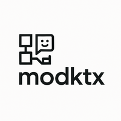

**modktx** (short for *Modular Knowledge Transformation eXtension*) is a modular TypeScript framework for orchestrating data pipelines, chat-based AI interactions, job scheduling, and output transformation. Its components can be used independently or composed together using processors and clients.

## Features

- **Composable Pipelines**: Build content flows by combining static text, dynamic data, and AI-generated responses.
- **Flexible Scheduling**: Run tasks automatically at defined intervals, either sequentially or in parallel.
- **Data Integration**: Incorporate financial or external data sources with support for technical indicators and transformations.
- **Advanced Post-Processing**: Convert, filter, or enhance content through customizable processing stages.
- **LLM Interaction**: Integrate large language models to generate, structure, or modify content through a unified interface.
- **Extensible Architecture**: Easily extend the system with new data sources, schedulers, and processors.

## Usage Overview

Here's an example that demonstrates how to compose content using static prompts and real-time OHLCV data, which is then formatted and analyzed using a chat-based LLM interface:

```ts
import {
  OHLCVComponent,
  ContentComposer,
  TextComponent,
  ContentPostProcessor,
  OHLCVCSVFormatter,
  ChatClient, OpenAIProvider,
} from 'modktx'

import { z } from 'zod'

;(async () => {
  let contentComposer = new ContentComposer()

  contentComposer.add(
    new TextComponent({
      content:
        'You are an expert in crypto futures trading. Please analyze the provided CSV data and give a trade recommendation.',
    }),
  )

  contentComposer.add(
    new ContentPostProcessor(
      new OHLCVComponent({
        exchange: 'binance',
        symbol: 'BTC/USDT',
        timeframe: '5m',
        inputCandles: 150,
        outputCandles: 100,
        indicators: {
          sma: { period: 20 },
          ema: { period: 9 },
          rsi: { period: 14 },
          atr: { period: 14 },
          macd: { short_period: 12, long_period: 26, signal_period: 9 },
          bbands: { period: 20, stddev: 2 },
        },
      }),
      new OHLCVCSVFormatter(),
    ),
  )

  let content = await contentComposer.compose()

  let chatClient = new ChatClient(
    new OpenAIProvider()
  )
  
  let result = await chatClient.invokeWithStructuredOutput(
    content,
    z.object({
      explanation: z
        .string()
        .describe(
          'A concise overview (2–4 sentences) of the market situation and the reasoning behind the trade recommendation.',
        ),
      recommendation: z
        .enum(['long', 'short', 'wait'])
        .describe(
          'The trade direction: "long" for buying, "short" for selling, or "wait" if no action is recommended.',
        ),
    }),
  )

  console.log(result)
})()

```

**Output**

```json
{
  "explanation": "The BTC/USDT market is currently experiencing a strong upward momentum. Over the past few hours, BTC prices have shown a consistent increase, trading well above the moving averages (sma and ema), which indicates a stronger bullish trend. RSI is in the 60-75 range, suggesting moderate overbought conditions, but not at an extreme level that would typically indicate an imminent reversal. The MACD is also above its signal line and continues to show positive growth, reinforcing the bullish sentiment. Given this data and the substantial historical volume, it appears the market is primed for further upward movement.",
  "recommendation": "long"
}
```


## Core Module Overview

The modktx framework is organized into modular subsystems, each responsible for a distinct aspect of content orchestration and AI integration.

### Data Components

Reusable content blocks and structured data sources that can be composed into processing pipelines.

👉 [Explore available components](docs/components.md)

### Post-Processing Layers

Apply transformations, formatting, or enhancements to generated content after initial composition.

👉 [View post-processing options](docs/postprocessors.md)

### AI Interaction Interface

A unified abstraction for interacting with large language models such as OpenAI or Ollama.

👉 [Read more in the AI interface documentation](docs/chat.md)

### Task Orchestration

Schedule and manage recurring or on-demand processing jobs with support for interval-based execution.

👉 [Learn about the Job Scheduler](docs/jobs.md)
